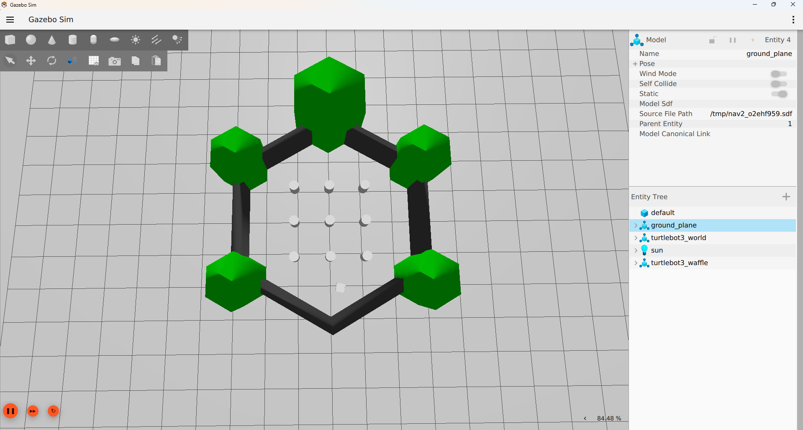
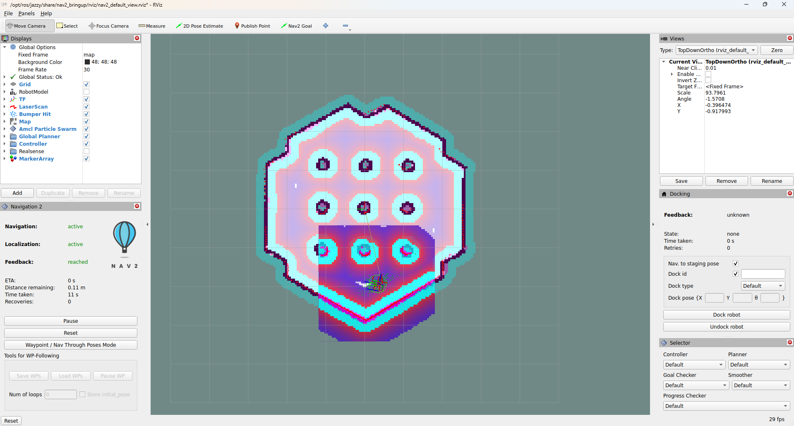
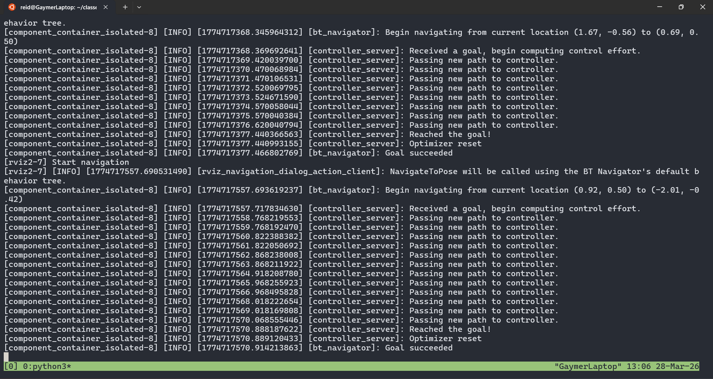

# Project 7: Introduction to the ROS2 Navigation Stack

## Team Members
- Eineje Victor Ameh
- Reid Beckes

## Introduction and Setup

This project introduced the ROS 2 Navigation Stack (Nav2) through both simulation and physical robot operation. The goal was to understand how a mobile robot localizes itself, plans a path, avoids obstacles, and navigates to a commanded goal in both known and unknown environments.

For this project, we used ROS 2 Jazzy on Ubuntu 24.04. We worked with the TurtleBot3 Burger in simulation and on physical hardware. For the real robot portion, we connected to the lab robot network, remotely accessed the TurtleBot, and used Cartographer to build a 2D occupancy grid map.

### Setup Challenges and Resolutions

One challenge was setting up the required TurtleBot3 packages and sourcing the correct workspaces before launching simulation, mapping, and navigation nodes. We resolved this by installing the required ROS 2 packages, cloning the TurtleBot3 repositories into a workspace, and consistently sourcing both `/opt/ros/jazzy/setup.bash` and the workspace `install/setup.bash`.

Another challenge was connecting to the physical TurtleBot from the laptop. We resolved this by connecting to the robot lab Wi-Fi, using a `turtlebot_connect.sh` script with the correct `TURTLEBOT3_MODEL`, `RMW_IMPLEMENTATION`, and `ROS_DOMAIN_ID`, and verifying the robot topics with `ros2 topic list`.

A third challenge was Git and GitHub authentication. We had to configure Git identity correctly and switch from HTTPS authentication to SSH keys in order to push reliably to GitHub.
- Reid Beckes
- Eineje Victor Ameh

## Introduction and Setup

This project introduced the ROS 2 Navigation Stack (Nav2) through simulated and real-world robot navigation tasks. The overall goal was to understand how a mobile robot localizes itself, builds or uses a map, plans a path, and avoids obstacles while moving to a goal.

For this project, we used ROS 2 Jazzy on Ubuntu 24.04. We worked with the TurtleBot3 Burger in both simulation and on physical hardware. For the real robot portion, we also used the lab Wi-Fi setup and remote ROS communication between the laptop and the robot.

### Setup Challenges and Resolutions
One challenge was package setup for TurtleBot3 simulation and navigation. We resolved this by installing the required ROS 2 packages, cloning the TurtleBot3 repositories into a workspace, and sourcing the correct setup files before launching nodes.

Another challenge was connecting to the physical TurtleBot3 from the laptop. We resolved this by connecting to the `ee3280_roslab` network, using a `turtlebot_connect.sh` script with the correct `ROS_DOMAIN_ID`, and verifying the robot topics with `ros2 topic list`.

A third challenge was Git/GitHub setup. We had to fix the repository setup, configure Git identity, and switch from HTTPS to SSH authentication so we could push changes successfully.

---

## Part 1 — TurtleBot3 Simulation

For Part 1, we launched the TurtleBot3 Burger simulation in Gazebo and started the Nav2 stack in a second terminal. After launching RViz2, we used the **2D Pose Estimate** tool to initialize AMCL and then sent multiple navigation goals using the **Nav2 Goal** tool.

### What We Observed

We observed that Nav2 generated a global path from the robot’s pose to the selected goal and continuously updated the robot’s local behavior through the local costmap. As the robot moved, RViz showed the path, obstacle inflation areas, and the robot’s current estimated pose. We also observed brief recovery or safety-related behavior in the logs, including collision-monitor warnings, but the robot still successfully reached the commanded goal.

This helped us understand the relationship between:
- localization through AMCL,
- global path planning,
- local trajectory control,
- and costmap-based obstacle avoidance.

### Part 1 Evidence

---

## Part 2 — Real-World Mapping of EERC 722

For Part 2, we used the physical TurtleBot3 Burger and connected to it remotely from the laptop. We first connected the laptop to the lab robot network and used a TurtleBot connection script so the laptop could access the robot topics. Then we SSHed into the TurtleBot3 and launched the onboard bringup node. On the laptop, we launched Cartographer and RViz2, then started keyboard teleoperation in a separate terminal.

### Mapping Strategy

We drove the TurtleBot3 slowly around the perimeter of the room first so the outer wall structure would appear clearly in the map. After that, we moved through interior areas to capture more features and open space. We tried to keep motion smooth and mostly linear, and used in-place turns instead of wide arcs whenever possible to reduce odometry-related distortion.

### Mapping Artifacts and Challenges

The biggest challenge during mapping was keeping the map crisp and avoiding blurry or shifted walls. Fast or uneven motion can make the map less accurate because SLAM depends on noisy odometry and scan matching. To reduce this, we slowed down, avoided unnecessary turning, and revisited previously seen areas to improve consistency and loop closure.

### Saved Map

We drove the TurtleBot3 slowly around the perimeter of the room first so the outer wall structure would appear clearly in the map. After that, we moved through interior areas to capture more features and open space. We tried to keep motion smooth and mostly linear, and used in-place turns instead of wide arcs whenever possible to reduce odometry-related distortion.

### Mapping Artifacts and Challenges
The biggest challenge during mapping was keeping the map crisp and avoiding blurry or shifted walls. Fast or uneven motion can make the map less accurate because SLAM depends on noisy odometry and scan matching. To reduce this, we slowed down, avoided unnecessary turning, and revisited previously seen areas to improve consistency and loop closure.

### Saved Map
The completed map was saved as:
- `maps/map_eerc722.yaml`
- `maps/map_eerc722.pgm`

### Part 2 SLAM Evidence

### Part 2 Navigation in the Real Room

After saving the map, we relaunched navigation using the saved map and used RViz2 to initialize the robot pose and send point-to-point navigation goals in the real room.

### Part 2 Navigation in the Real Room
After saving the map, we relaunched navigation using the saved map and used RViz2 to initialize the robot pose and send point-to-point navigation goals in the real room.

---

## Part 3 — Jackal Simulation

This section is reserved for the Clearpath Jackal simulation portion of the project.

### Placeholder Evidence Files Already in the Repository

### Comparison Notes

Compared with the TurtleBot3 workflow, the Jackal simulation workflow is expected to involve a different robot platform and Nav2 integration path. However, the overall navigation concepts remain the same: localization, path planning, costmaps, and autonomous goal execution in RViz.
**To be completed.**

This section will include:
- the Gazebo screenshot for the Jackal simulation,
- the RViz navigation screenshot,
- the saved `map_jackal_sim.yaml` and `map_jackal_sim.pgm` files,
- and a short comparison between the Jackal setup and the TurtleBot3 setup.

---

## AI Use Documentation
How AI was used:
- To help draft and structure the README

How AI was used:
- Used to help draft and structure the README

---

## Conclusion

<<<<<<< HEAD
Through this project, we practiced both simulated and physical robot navigation using ROS 2 and the Nav2 stack. Part 1 demonstrated how localization, planning, and costmaps interact in simulation. Part 2 showed the added complexity of real hardware, networking, teleoperation, and SLAM map quality. Together, these parts strengthened our practical understanding of autonomous navigation with ROS 2.
Through this project, we practiced simulated navigation, real-world SLAM mapping, and ROS 2-based robot control using the Nav2 stack. Part 1 demonstrated how localization, planning, and costmaps interact in simulation, while Part 2 showed the added complexity of real hardware, networking, teleoperation, and SLAM map quality. These exercises built a stronger practical understanding of autonomous navigation with ROS 2.

